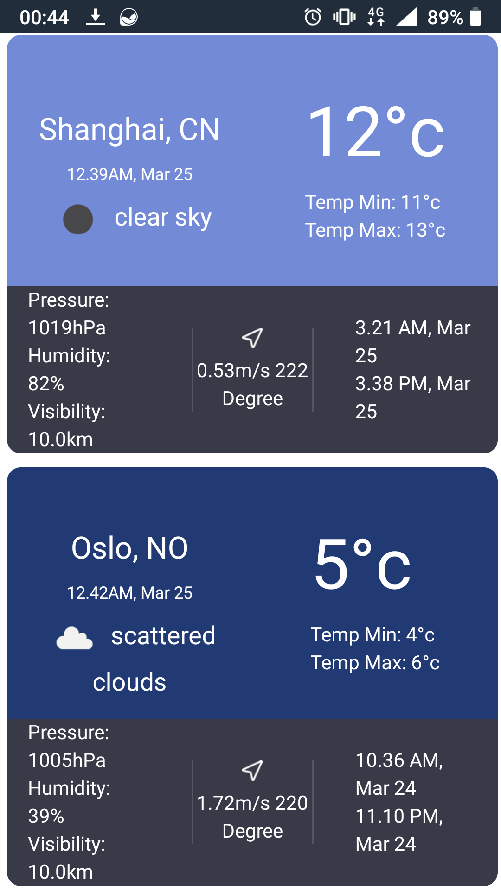
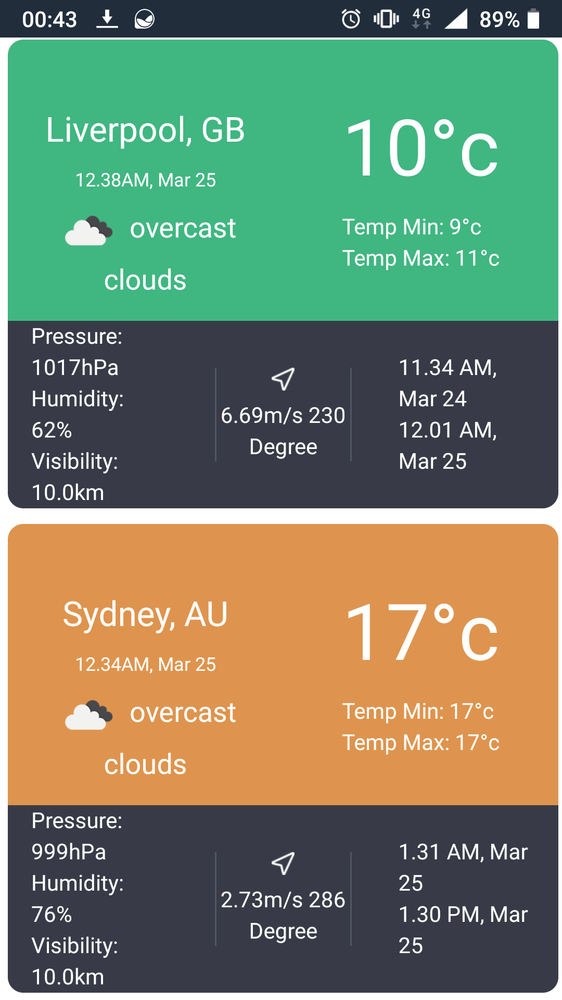
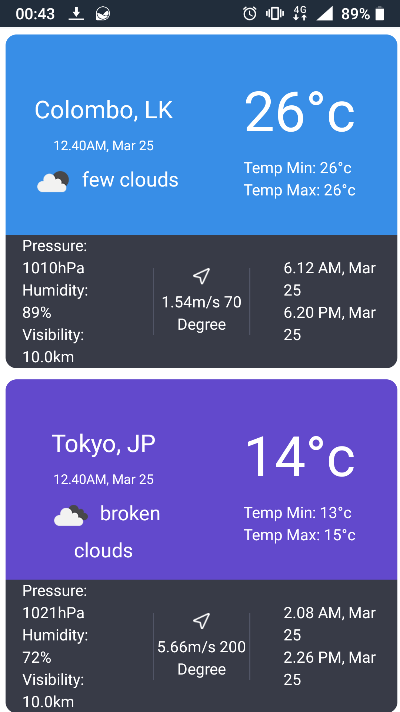
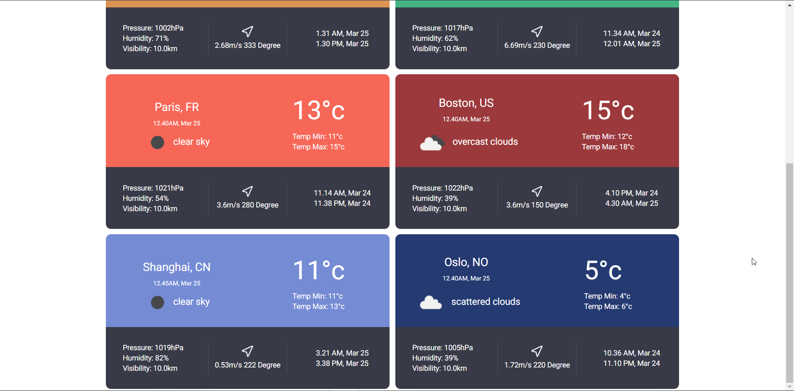
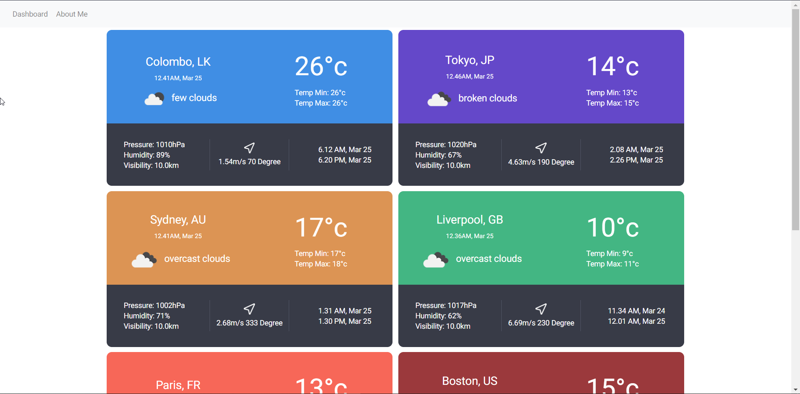

# Weather Dashboard

A simple weather dashboard that displays weather information of selected cities. It uses the weather API of openweathermap to retrieve weather information. I have developed this application for an interview assignment, and plan to continue its development by adding more functionalities in the future.  

## Features

- Show weather information of selected cities.
- Mobile support (responsive)

## Requirements 

- A web server (preferablly Nginx installed on a VPS)
- The [API Key](https://home.openweathermap.org/api_keys)
- Visual Studio Code

## How to Install

- Download the Angular application to your computer
- Open it via Visual Studio code
- Type npm install to install required packages in the package.json file.
- Copy The [API Key](https://home.openweathermap.org/api_keys) after registering in the site.
- Create two environment files in environments folder called environment.ts, and environment.prod.ts
- Copy the environment constant to both the files. 
- Make the production boolean false in environment.ts file. 

## Developer
Badde Liyanage Don Dilanga, 2021/March, github@dilanga.com.
Sri Lanka LK. 

## License
Simple non code license (SNCL)

# Screenshots
     
